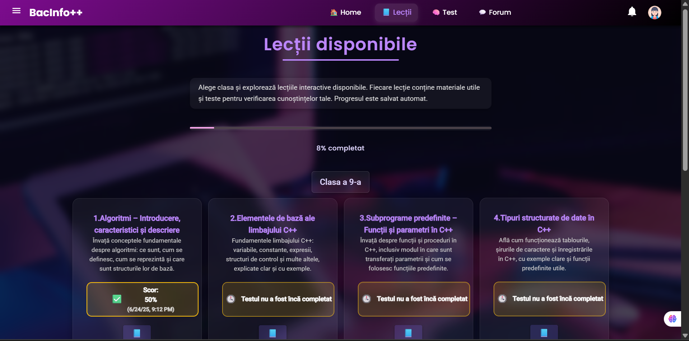

# BacInfo

**BacInfo** is a full-stack e-learning web application designed to help Romanian high school students prepare for the Informatics Baccalaureate exam.

## Features

- 📚 **Interactive Lessons** – Structured lessons with clear explanations.
- ✅ **Quizzes & Tests** – Multiple-choice tests to check understanding.
- 📊 **Progress Tracking** – Monitor scores and completed chapters.
- 🔐 **Authentication & Roles** – Secure login (JWT & Google OAuth 2.0), with separate roles for students, teachers, and admins.
- 🗂️ **Admin Panel** – Manage users, lessons, tests, and student progress.
- 🧑‍🏫 **Teacher Tools** – Export tests to PDF for offline use.
- 💬 **Forum** – Ask questions and get help from peers or teachers.

## Tech Stack

- **Frontend:** Angular
- **Backend:** Java Spring Boot
- **Database:** PostgreSQL
- **Authentication:** JWT, OAuth 2.0 (Google)

## How to Run

1. **Clone the repository**

   ```bash
   git clone https://github.com/your-username/bacinfo.git
   ```

2. **Set up the Backend**

   - Navigate to the backend project directory.

   - Create a PostgreSQL database named `bacinfo` (or update the name in `application.properties`).

   - Configure your database credentials (`spring.datasource.username` and `spring.datasource.password`).

   - Run database migrations if using Flyway (optional, if included).

   - Build and run the Spring Boot application:

     ```bash
     mvn spring-boot:run
     ```

   - The backend server will start on [http://localhost:8080](http://localhost:8080).

3. **Set up the Frontend**

   - Navigate to the frontend directory:

     ```bash
     cd frontend
     ```

   - Install dependencies:

     ```bash
     npm install
     ```

   - Start the Angular development server:

     ```bash
     ng serve
     ```

   - The frontend will run on [http://localhost:4200](http://localhost:4200).

## Access the Application

- Open [http://localhost:4200](http://localhost:4200) in your browser.
- Register a new user or log in with Google.
- Explore lessons, take quizzes, and manage content based on your role.

## Screenshots

### 🏠 Home Page


### 📖 About Page


### 🔐 Login Page


### 📚 Lessons Page


### 📚 Lesson Page


### 📚 Test Page


### 💬 Forum Page


## Author

**Cristina-Daniela Lacovei**  
Bachelor’s Thesis – Transilvania University of Brașov  


## License

This project is intended for educational and non-commercial use.

---

**Thank you for checking out BacInfo! 🚀**
